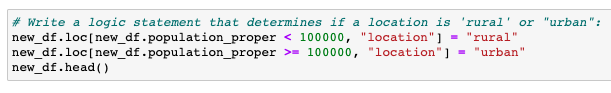
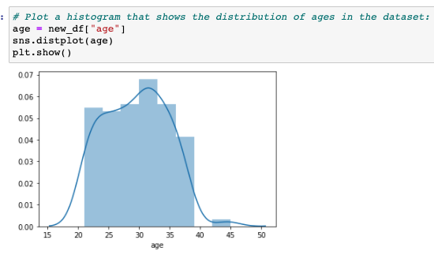
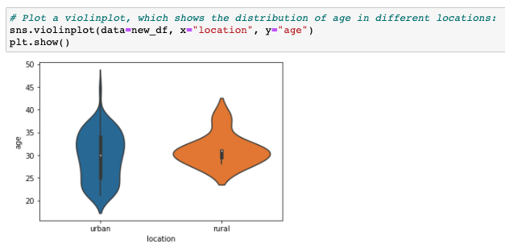
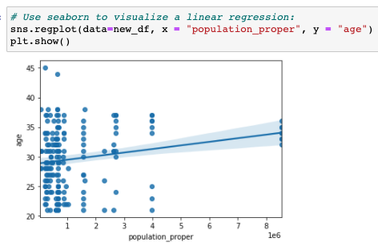

# Data-Science-Project

## Exploring Seaborn

* I obtained csv files of user_data and population_data from Code Academy to explore 'Seaborn'. Seaborn is a Python data visualization library based on matplotlib. It provides a high-level interface for drawing attractive and informative statistical graphics.

* I merged those csv files using city column, and created a new column of "location" using a population size.

* I checked the data distribution of 'age'

* And then, I made a violinplot, which showed the distribution of age in different locations (urban vs rural)

* Finally, I graphed the population to age as a scatterplot, and used seaborn to visualize a linear regression.

